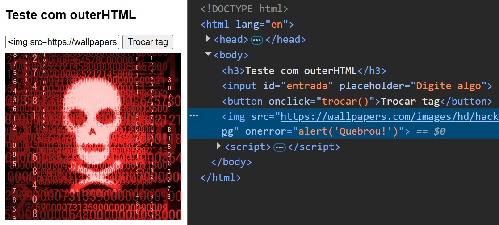

# Teste outerHTML — Substituição de Elementos no DOM

Projeto simples em HTML com JavaScript embutido para demonstrar o comportamento da propriedade `outerHTML`, mostrando como um elemento pode ser completamente substituído por outro conteúdo inserido pelo usuário.

## Preview




## Funcionalidades

* Campo para digitação de conteúdo pelo usuário.
* Botão para substituir um elemento da página.
* Demonstração de substituição completa de um elemento usando `outerHTML`.
* Exemplo prático de como HTML digitado pode alterar a estrutura da página.
* Validação simples impedindo substituição quando o campo está vazio.

## Tecnologias

* HTML5
* CSS
* JavaScript puro (sem bibliotecas externas)

## Estrutura do Projeto

```
teste-outerHTML/
│
├─ preview1.png
├─ preview2.png
└─ index.html
```

## Como usar

Clone o projeto:

```
git clone https://github.com/DevLabatut/teste-outerHTML.git
```

Entre na pasta:

```
cd teste-outerHTML
```

Abra o arquivo no navegador:

```
index.html
```

Digite um conteúdo e clique em **Trocar tag** para ver o elemento ser substituído.

## Exemplos para teste

Você pode testar entradas como:

```
<h1>Novo título</h1>
```

ou

```

```

para observar como o conteúdo inserido altera a página.

## Observações

* Projeto feito apenas para aprendizado.
* Não possui backend ou armazenamento de dados.
* A substituição do elemento remove o elemento original do DOM.
* Em aplicações reais, entradas do usuário devem ser tratadas antes de serem inseridas na página.

## Autor

| [<br><sub>DevLabatut</sub>](https://github.com/DevLabatut) |

| :---------------------------------------------------------------------------------------------------------------: |
